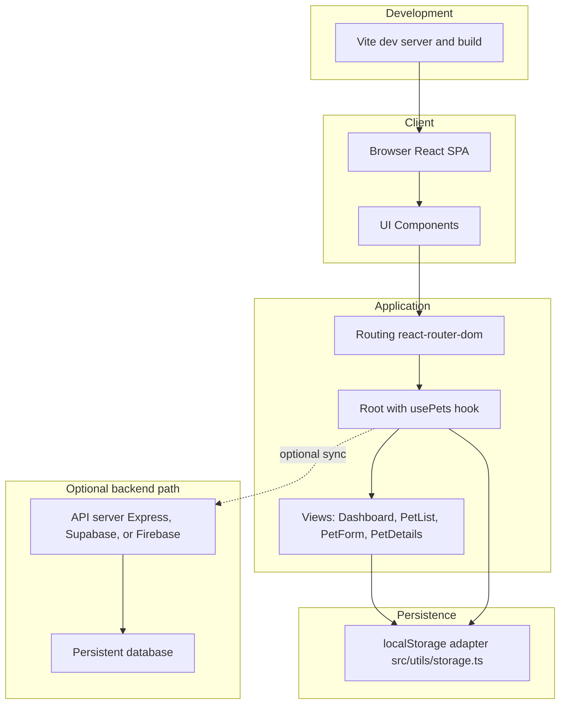
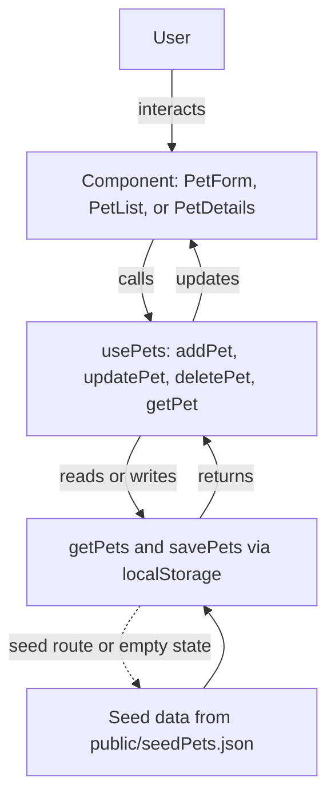
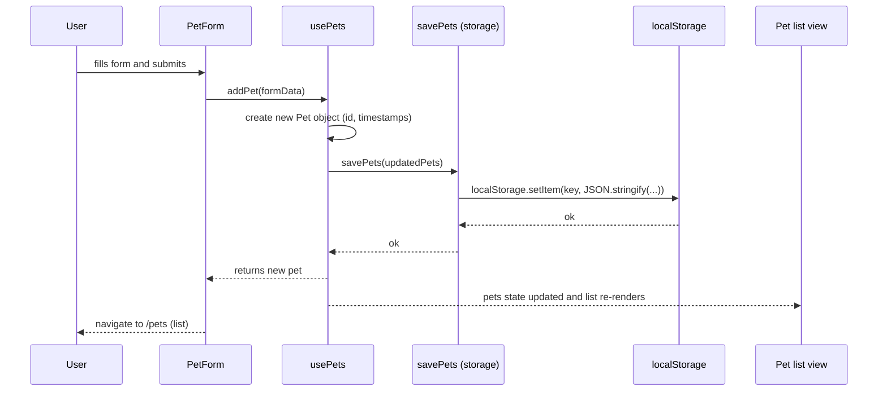

# LuxePets — System Architecture, Data Flow & Component Mapping

This document provides visual diagrams and a concise mapping of functional components to help you explain the `mini-clinic-glassmorphic` project architecture and runtime flows clearly. It uses Mermaid diagrams (`flowchart TD`, `sequenceDiagram`) for clean, top-down visuals that render in GitHub and other Markdown viewers with Mermaid support.

---

## Quick summary

- App type: Single Page Application (React + TypeScript)
- Runtime: Browser (Vite dev server during development)
- Persistence (current): Browser localStorage
- Core state manager: custom `usePets` hook (local state + persistence)
- UI context: premium mini-clinic experience with a glassmorphic shell

---

## System architecture (top-down)

Notes:
- The `usePets` hook is the single source of truth for pet data in the client. It reads/writes via `src/utils/storage.ts`.
- The `OptionalBackend` shows a path for a production backend (not currently implemented). The app is built to make this integration straightforward.

---

## Data flow (top-down, user action → persistence)

Explanation:
- The UI components call methods returned by `usePets`. Those methods mutate React state and persist changes by calling `savePets`, which writes to localStorage. On startup, `usePets` reads `getPets`; sample data is restored separately through the `/seed` route or the restore action in the sidebar.

---

## Sequence diagram — "Create a pet" flow

---

## Functional component mapping

- `src/hooks/usePets.ts`
  - Responsibility: stateful hook that exposes `pets`, `addPet`, `updatePet`, `deletePet`, `getPet`. Handles initial load, seed, and persistence.
  - Talking points: single source of truth, simple API, easy to swap with remote data source.

- `src/utils/storage.ts`
  - Responsibility: small adapter around localStorage: `getPets`, `savePets` with basic error handling.
  - Talking points: encapsulates storage so swapping to a backend is localized.

- `src/components/PetForm.tsx`
  - Responsibility: form UI, client-side validation, handles create and edit modes.
  - Talking points: validation strategy, UX decisions (simulate network delay), accessibility notes.

- `src/components/PetList.tsx`
  - Responsibility: search, filter, and display pet table; navigation to view/edit.
  - Talking points: performance (useMemo for filtered list), sorting, empty states.

- `src/components/PetDetails.tsx`
  - Responsibility: read-only profile view; friendly not-found UI.
  - Talking points: derived data formatting (age calculation), conditional UI.

- `src/components/Layout.tsx`
  - Responsibility: shell, navigation, theme/background.
  - Talking points: routing via `Outlet`, responsive layout.

---

## Suggested walkthrough

1. Start with the elevator pitch and open the browser to the running app.
2. Show `src/App.tsx` to explain routing and `Outlet` context provider (how `usePets` is provided to nested routes).
3. Open `src/hooks/usePets.ts` and explain initialization, API surface, and how it persists data.
4. Show `src/components/PetForm.tsx` and explain validation and UX; demonstrate creating a new pet and point to the sequence diagram.
5. Show `src/components/PetList.tsx` and `src/components/PetDetails.tsx` to explain listing/filtering and profile details.

---

## Extension ideas

- Swap localStorage for a backend API: create a small adapter that exposes the same `getPets`/`savePets` surface and use it inside `usePets`.
- Add optimistic updates and conflict resolution for offline-first flows.
- Add unit tests for the hook and form validation; add E2E tests (Playwright) for core flows.

---
